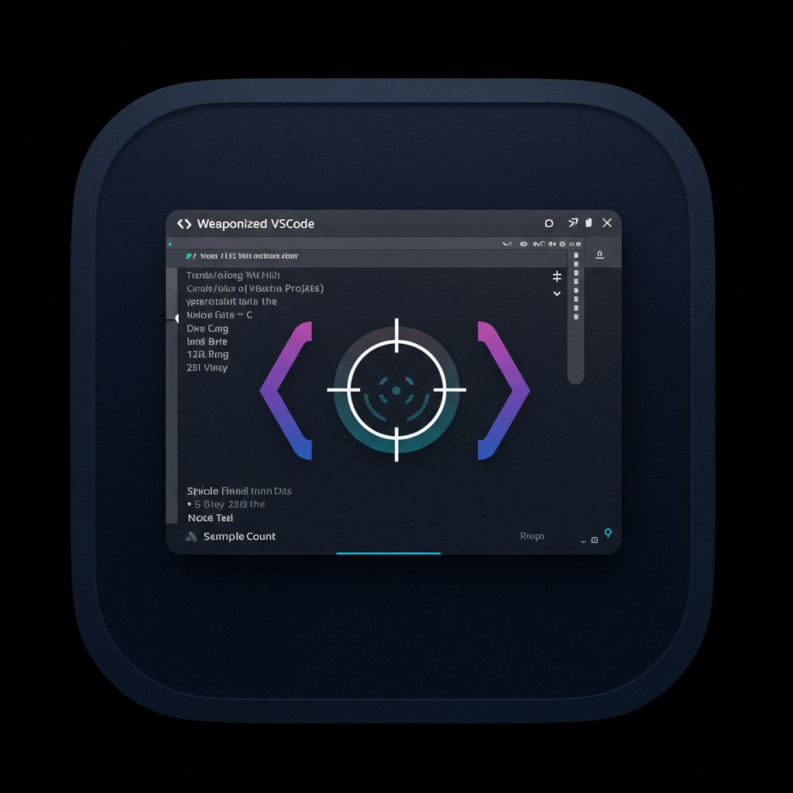

# Weaponized VSCode Extension



A powerful VSCode extension designed for penetration testing and cybersecurity workflows. This extension provides integrated tools for payload generation, host management, credential handling, and security scanning directly within your VSCode environment.

## Features

### 🎯 Host & Credential Management
- **Interactive CodeLens**: Automatic detection and management of hosts and credentials in YAML blocks within markdown files
- **Host Configuration**: Parse and manage target hosts with IP addresses, hostnames, aliases, and domain controller settings
- **Credential Management**: Handle user credentials with support for multiple authentication formats
- **Environment Variable Export**: One-click export of hosts and credentials as environment variables to terminal
- **Current Target Selection**: Easy switching between targets for focused operations

### 🛠️ Payload Generation & Tools
- **MSFVenom Integration**: Interactive payload creation with support for multiple payload types:
  - Windows/Linux Meterpreter (TCP/HTTP/HTTPS)
  - PHP, Python, Java payloads
  - Multiple output formats (exe, elf, psh, dll, hta-psh, etc.)
  - Advanced options (migration, fork, stealth settings)
- **Hashcat Integration**: Password cracking task automation
- **Network Scanning**: Integrated scanner support (rustscan, nuclei, dirsearch, wfuzz, etc.)

### 🖥️ Terminal Integration
- **Specialized Terminal Profiles**:
  - Meterpreter handler with automatic MSF console setup
  - Netcat reverse shell handler
  - Web delivery server for payload hosting
- **Command Execution**: Run commands directly from markdown code blocks
- **Interactive Task Terminals**: Dedicated terminals for long-running security tasks

### 📋 Workspace Management
- **Project Setup**: Automated workspace initialization with security-focused folder structure
- **File Monitoring**: Real-time synchronization of host/credential changes across markdown files
- **Variable Processing**: Dynamic environment variable generation from workspace state

### 🔍 Smart CodeLens Features
- **Export Functions**: Generate environment variables, /etc/hosts entries, YAML configurations
- **Format Conversion**: Convert credentials to impacket/NetExec compatible formats
- **Status Management**: Toggle current/active status for hosts and credentials
- **Command Integration**: Execute related commands directly from documentation

## Usage

### Installation & Setup

1. **Compile and Install**:
   ```bash
   # Clone the repository
   git clone https://github.com/Esonhugh/vscode-weaponized.git
   cd vscode-weaponer
   
   # Install dependencies
   pnpm install
   
   # Build the extension
   pnpm vscode:publish 
   # output a .vsix file in the repo root directory
   
   # Install in VSCode
   code --install-extension ./weaponized-*.vsix
   ```

2. **Initialize Workspace**:
   - Open a folder in VSCode
   - Run command: `weapon: Setup/Create/Init weaponized vscode folder in current workspace`
   - This creates the necessary folder structure and configuration files

### Basic Operations

#### Host Management
Create markdown files in `hosts/*/` directories with YAML blocks:

```markdown
## Target Hosts

```yaml host
- hostname: target.example.com
  ip: 192.168.1.100
  alias:
    - web01.example.com
    - www.example.com
  is_dc: false
  is_current: true
```

#### Credential Management
Create markdown files in `users/*/` directories:

```markdown
## Credentials

```yaml credentials
- username: admin
  password: password123
  domain: EXAMPLE
  hash: aad3b435b51404eeaad3b435b51404ee:5fbc3d5fec8206a30f4b6c473d68ae76
  is_current: true
```

#### Command Execution
Add executable code blocks in markdown:

```markdown
```bash
nmap -sS -sV $TARGET
```

#### Payload Generation
1. Run: `weapon: task: Create msfvenom payload`
2. Select payload type (e.g., `windows/x64/meterpreter/reverse_tcp`)
3. Choose output format (e.g., `exe`, `psh`, `dll`)
4. Configure advanced options if needed
5. Specify output filename

#### Network Scanning
1. Run: `weapon: task: Run scanner over target`
2. Select target from discovered hosts
3. Choose scanner type (rustscan, nuclei, dirsearch, etc.)
4. Scanner executes in dedicated terminal

## Requirements

### System Requirements
- **VSCode**: Version 1.101.0 or higher
- **Node.js**: For extension runtime
- **Operating System**: macOS, Linux, or Windows

### Security Tools (Optional but Recommended)
- **Metasploit Framework**: For payload generation and handlers
  - `msfvenom` - Payload generation
  - `msfconsole` - Handler management
- **Hashcat**: Password cracking capabilities
- **Network Scanners**: One or more of:
  - `rustscan` - Fast port scanner
  - `nuclei` - Vulnerability scanner
  - `dirsearch` - Directory enumeration
  - `wfuzz` - Web application fuzzer
  - `nmap` - Network discovery and security auditing
- **Shell Handlers**:
  - `netcat` or `ncat` - Basic reverse shell handling
  - `rlwrap` - Readline wrapper for better shell interaction
  - `pwncat-cs` - Enhanced reverse shell handler (alternative)

### Workspace Structure
The extension expects a specific folder structure:
```
workspace/
├── .vscode/
│   ├── settings.json (generated by setup)
│   └── .zshrc (trigger file)
├── hosts/
│   └── [category]/
│       └── *.md (host definitions)
├── users/
│   └── [category]/
│       └── *.md (credential definitions)
└── services/
    └── [category]/
        └── *.md (service information)
```

## Extension Settings

### Network Configuration
- **`weaponized.lhost`** (string, default: `"${LHOST}"`)
  - Local host IP address for receiving reverse connections
  - Used for payload generation and handler setup
  - Supports environment variable substitution

- **`weaponized.lport`** (integer, default: `6879`)
  - Local port for reverse shell connections
  - Primary listening port for payload callbacks

- **`weaponized.listenon`** (integer, default: `8890`)
  - Port for web delivery services
  - Used when hosting payloads via HTTP server

### Tool Paths & Commands
- **`weaponized.netcat`** (string, default: `"rlwrap -I -cAr netcat -lvvp ${config:weaponized.lport}"`)
  - Netcat command template for reverse shell handling
  - Supports rlwrap for improved shell interaction
  - Alternative: `"pwncat-cs -lp ${config:weaponized.lport}"`

- **`weaponized.webdelivery`** (string, default: `"simplehttpserver -listen 0.0.0.0:${config:weaponized.listenon} -verbose -upload"`)
  - Web server command for payload delivery
  - Alternative: `"python3 -m http.server ${config:weaponized.listenon}"`

- **`weaponized.hashcat`** (string, default: `"hashcat"`)
  - Path to hashcat executable
  - Used for password cracking tasks

### Metasploit Integration
- **`weaponized.msf.venom`** (string, default: `"msfvenom"`)
  - Path to msfvenom executable for payload generation

- **`weaponized.msf.console`** (string, default: `"msfconsole"`)
  - Path to msfconsole for handler management

- **`weaponized.msf.resourcefile`** (string, optional)
  - Path to MSF resource file for automated handler setup
  - File will be created if it doesn't exist

### Scanner Configuration
- **`weaponized.scanners`** (object)
  - Dictionary of scanner commands with `$TARGET` placeholder
  - Default scanners included:
    - **rustscan**: `"rustscan -a $TARGET -- --script=vuln -A"`
    - **nuclei**: `"nuclei -target $TARGET"`
    - **dirsearch**: `"dirsearch -u http://$TARGET"`
    - **dirsearch https**: `"dirsearch -u https://$TARGET"`
    - **wfuzz**: `"wfuzz -c -w $SUBDOMAIN_TOP_100000 -u http://$TARGET -H 'Host: FUZZ.$TARGET' --hc 404"`
    - **wfuzz https**: `"wfuzz -c -w $SUBDOMAIN_TOP_100000 -u https://$TARGET -H 'Host: FUZZ.$TARGET' --hc 404"`

### Environment Variables
- **`weaponized.envs`** (object, default: `{}`)
  - Custom environment variables for commands and tasks
  - Example: `{"WORDLIST_PATH": "/usr/share/wordlists", "CUSTOM_VAR": "value"}`
  - Variables are automatically injected into terminal sessions

### Example Complete Configuration
```json
{
  "weaponized.lhost": "10.10.14.5",
  "weaponized.lport": 4444,
  "weaponized.listenon": 8000,
  "weaponized.netcat": "pwncat-cs -lp ${config:weaponized.lport}",
  "weaponized.webdelivery": "python3 -m http.server ${config:weaponized.listenon}",
  "weaponized.hashcat": "/usr/bin/hashcat",
  "weaponized.msf.venom": "/usr/bin/msfvenom",
  "weaponized.msf.console": "/usr/bin/msfconsole",
  "weaponized.msf.resourcefile": "./handlers.rc",
  "weaponized.envs": {
    "WORDLIST_DIR": "/usr/share/wordlists",
    "CUSTOM_PAYLOAD_DIR": "./payloads",
    "SUBDOMAIN_TOP_100000": "/usr/share/wordlists/subdomains-top1million-20000.txt"
  },
  "weaponized.scanners": {
    "nmap_full": "nmap -sS -sV -O -A -T4 --script vuln $TARGET",
    "masscan": "masscan -p1-65535 $TARGET --rate=1000",
    "custom_scan": "my-custom-scanner --target $TARGET --aggressive"
  }
}
```

## Advanced Features

### Variable Substitution
The extension supports dynamic variable substitution in commands:
- `$TARGET` - Current target hostname/IP
- `$LHOST` - Local host configuration
- `$LPORT` - Local port configuration
- `${config:weaponized.setting}` - Any extension setting
- Custom environment variables from `weaponized.envs`

### CodeLens Actions
When viewing markdown files with YAML blocks, CodeLens provides:
- **Export to Terminal**: Generate and execute environment variable exports
- **Set as Current**: Mark hosts/credentials as active targets
- **Format Conversion**: Convert credentials to tool-specific formats
- **Copy to Clipboard**: Quick access to formatted data

### Terminal Profiles
Access specialized terminals via VSCode's terminal profile menu:
- **Meterpreter Handler**: Auto-configured MSF console with handler
- **Netcat Handler**: Listening netcat session for reverse shells
- **Web Delivery**: HTTP server for payload hosting

### Automation Support
- File watching automatically updates environment variables when hosts/credentials change
- Workspace state synchronization across multiple markdown files
- Integrated logging for debugging and audit trails

---

**Security Notice**: This extension is designed for authorized penetration testing and security research. Ensure you have proper authorization before using these tools against any systems.
